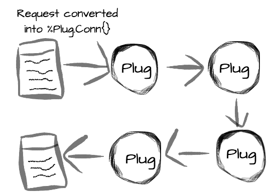

> Plug in Elixir - Is it an abstraction layer between the two

Per [the Plug GitHub page][6] a plug is a "specification for composable
modules between web applications.".

In the `Elixir` world, `Plug` is the specification that enables different
frameworks to talk to different web servers in the `Erlang` VM.
If you are  familiar with `Ruby`, `Plug` tries to solve the same problem
that `Rack` does, just with a different approach.

Yes, exactly! Plug is meant to be a generic adapter for different web
servers. Currently we support just Cowboy but there is work to support
others.

Plug also defines how different components should be plugged together.
Similar to Rack in Ruby, WSGI in Python, Ring in Clojure, and so on.

*Plug is both. It is the component that sits between and it also defines
a specification. Plugs are not stacked, it works more like a pipeline
where a plug hands off the connection to the next plug* - José Valim.

Understanding the basics of how `Plug` works will make it easier to get up
to speed with `Phoenix`,  and probably any other web framework that is
created for `Elixir`.

**The role of a plug**

You can think of a `Plug` as a *piece of code* that receives a data
structure, does some sort of transformation, and returns this same data
structure, slightly modified. This data structure that a `Plug`
receives and returns is usually called `connection`, and represents
everything that there is to know about a request.

As plugs always receive and return a `connection`, they can be easily
composable, forming what is called a *Plug pipeline*. Actually, that is
what usually happens. We receive a request, then each `plug` transforms
this request a little bit and pass the result to the next plug, until
we get a response.

This `connection` that our plugs will be dealing with all the time is a
simple [Elixir struct][3], called `%Plug.Conn{}` which is [very well
documented][4].

***



***


**The two types of Plugs**

There are two types of `Plug`'s we can have: `Function plugs` and
`Module plugs`.

A **function plug** is any function that receives a `connection` (that
is a `%Plug.Conn{}`) and a set of options, and returns a `connection`
Here is a simple example of a valid `Plug`:

```
def my_plug(conn, opts) do
  conn
end
```

A **Module plug** is any module that implements two function: `init/1`
and `call/2`, like this:

```
module MyPlug do
  def init(opts) do
    opts
  end

  def call(conn, opts) do
    conn
  end
end
```

One interesting characteristic of module plugs is that `init/1` is
executed in compile time, while `call/2` happens at run time.

The value returned by `init/1` will be passed to `call/2`, making
`init/1` the perfect place to do any heavy lifting and let `call/2`
run as fast as possible at run time.

There are two main uses I can think of when you would want a function
plug:

1. You want a plug that is local to a file (controller, router,
   endpoint, etc.) A module plug is preferred if you want it to be
   available from multiple files.
2. You are writing a library that allows you to use the function plug in
   the module (Phoenix does this for `put_layout` and `scrub_params`)

Most of the time, my plugs start as functions while I am developing
them, then I move them out to their own modules.

The module plug has the benefit of being able to perform some login in
the `init/1` function that will later be passed to the `call/2`
function.

`init/1` may be called during compilation which means it may gives you
performance boost since most plugs need configurations before it
actually do its job. With a function plug, those configurations have to
be done in runtime, so module plug is more appropriate for this
scenario.

**A simple example**

To try to make things more concrete, let’s create a simple application
that uses a plug to handle an http request.

First, create a project with `mix`: `$ mix new rephink`

Then `cd` into the project’s directory and edit `mix.exs` adding `Plug`
and `Cowboy` (the web server) as dependencies:

```
defp deps do
  [
    {:plug, "~> 1.4"},
    {:cowboy, "~> 1.1"}
  ]
end
```

Now run `mix deps.get` to install these dependencies and we should be
good to start.

Our first plug will simply return a "Hello, World!" text:

```
# lib/rephink.ex
defmodule Rephink do
  # The Plug.Conn module gives us the main functions
  # we will use to work with our connection, which is
  # a %Plug.Conn{} struct, also defined in this module.
  import Plug.Conn

  def init(opts) do
    # Here we just add a new entry in the opts map,
    # that we can use in the call/2 function
    Map.put(opts, :my_option, "Hello")
  end

  def call(conn, opts) do
    # And we send a response back, with a status code and a body
    send_resp(conn, 200, "#{opts[:my_option]}, World!")
  end
end
```

To use this plug, open `iex -S mix` and run:

```
Plug.Adapters.Cowboy.http(Rephink, %{}) #=> {:ok, #PID<0.174.0>}
```

Here we use the `Cowboy` adapter, and tell it to use our plug. We also
need to pass an `options` value that will be used by `init/1`.
This should have started a `Cowboy` web server on port 4000, so if you
open `http://localhost:4000` you should see the "Hello, World!" message.

This was simple enough. Let’s just try to make this `plug` a bit smarter
and return a response based on the URL we hit, so if we access:
`http://localhost:4000/Name`, we should see “Hello, Name”.

I said that a `connection` represents everything there is to know about
a request, and that includes the request path. We can just pattern match
on this request path to create the response we want. Let’s change the
`call/2` function to be like this:

```
def call(%Plug.Conn{request_path: "/" <> name} = conn, opts) do
  send_resp(conn, 200, "Hello, #{name}")
end
```

And that’s it. We pattern match the `connection` to extract just the
information we want, the name, and then send the response we want back
to the web server.

**Pipelines, because one ant is no ant**

`Plug` gets more interesting when you start composing multiple plugs
together, each one doing a small task and handing a modified
`connection` to the next.
`Phoenix`, the web framework, uses these pipelines in a clever way. By
default, if we are handling a normal browser request, we have a pipeline
like this `lib/rephink_web/router.ex`:

```
pipeline :browser do
  plug :accepts, ["html"]
  plug :fetch_session
  plug :fetch_flash
  plug :protect_from_forgery
  plug :put_secure_browser_headers
end
```

In case we are handling an api request, we don’t need most of these
things, so we can have a simpler pipeline just for our api:

```
pipeline :api do
  plug :accepts, ["json"]
end
```

Now, this is a `Phoenix` abstraction, but `Plug` gives us an easy way to
build our own pipelines: `Plug.Builder`.

Here’s an example of how it works:

```
defmodule MyPipeline do
  # We use Plug.Builder to have access to the plug/2 macro.
  # This macro can receive a function or a module plug and an
  # optional parameter that will be passed unchanged to the
  # given plug.
  use Plug.Builder

  plug Plug.Logger
  plug :extract_name
  plug :greet, %{my_option: "Hello"}

  def extract_name(%Plug.Conn{request_path: "/" <> name} = conn, opts) do
    assign(conn, :name, name)
  end

  def greet(conn, opts) do
    conn
    |> send_resp(200, "#{opts[:my_option]}, #{conn.assigns.name}")
  end
end
```

Here we combined three plugs, `Plug.Logger`, `extract_name` and `greet`.
The `extract_name` uses `assign/3` to assign a value to a key in this
connection. `assign/3` returns a modified `connection`, that is then
handed to the `greet` plug, that basically reads this assigned value to
create the response we want.

`Plug.Logger` is shipped with `Plug` and, as you probably guessed, is
used to log our http requests. A bunch of useful plugs like this are
available out of the box, you can find the list and descriptions in the
[docs][5]("Available Plugs" section).

Using this pipeline is as simple as using a single plug:

```
Plug.Adapters.Cowboy.http MyPipeline, %{}
```

One important thing to keep in mind is that the plugs will always be
executed in the order they are defined in the pipeline.

Another interesting thing is that these pipelines created with
`Plug.Builder` are also plugs, so we can have pipelines that are
composed by other pipelines.


The main idea is that we have our request represented as a
`%Plug.Conn{}`, and this struct is passed from function to function,
being slightly modified in each step, until we have a response that can
be sent back. `Plug` is a specification that defines how this should
work and creates an abstractions so multiple frameworks can talk to
multiple web server, as long as they are respecting the specification.

It also ships with these convenience modules that make it easier to do a
lot of things that are common to most applications, like creating
pipelines, simple routers, dealing with cookies, headers, etc.

In the end of the day, it’s just that simple functional programming idea
of passing data through functions until we get the result we want, and
in this case the data happens to be an http request.

### 2017 August Oleg G.Kapranov

[1]: http://www.brianstorti.com/getting-started-with-plug-elixir/
[2]: https://habrahabr.ru/post/306334/
[3]: http://elixir-lang.org/getting-started/structs.html
[4]: https://hexdocs.pm/plug/Plug.Conn.html
[5]: https://hexdocs.pm/plug/readme.html
